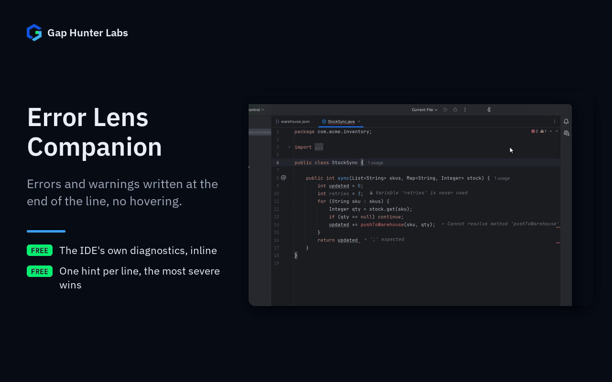

# Error Lens Companion

IntelliJ-family plugin. Shows errors and warnings inline, at the end of
the line that has them, instead of only as a gutter icon or a squiggly
underline you have to hover to read. One hint per line (most severe
diagnostic wins) so it never turns into unreadable clutter.



Each feature on its own:
[Inline diagnostics](docs/media/01-inline.gif) ·
[Any language](docs/media/02-json.gif)

## Why it exists

Ports the "Error Lens" concept -- VS Code's Error Lens extension has
10M+ installs and is one of that ecosystem's most-used extensions --
into the IDE's own highlighting pipeline. Confirmed before building this
that no equivalent already exists in JetBrains Marketplace. Same
"port a proven concept, no equivalent exists yet" bet as the other 6
plugins built this same session -- the same documented-exception
discipline this follows.

## Why built this way

- **Reads, never re-analyzes.** `ErrorLensHighlightingPass` is
  registered (via `TextEditorHighlightingPassFactoryRegistrar`) to run
  *after* the IDE's own general highlighting pass (`Pass.UPDATE_ALL`)
  finishes, and only reads the `HighlightInfo` results that pass already
  computed, through `DaemonCodeAnalyzerEx.processHighlights`. It never
  triggers, duplicates, or slows down any actual code analysis --
  structurally, it cannot be the reason your inspections get slower.
- **Refreshed once highlighting has finished.** The platform drops the
  highlights that no longer apply only when the whole highlighting
  session ends, after that pass. `ErrorLensDaemonListener`
  (`DaemonCodeAnalyzer.DaemonListener.daemonFinished`) re-reads the final
  highlights then. Before 0.1.1 a fixed problem could keep its inline
  hint: typing a missing `;` removed the error from the editor while
  "`';' expected`" stayed at the end of the line.
- **Off-EDT where the platform requires it.** `doCollectInformation`
  (reading `HighlightInfo`s) runs on a background thread, exactly like
  the platform's own `TextEditorHighlightingPass` contract requires --
  confirmed for real while writing `ErrorLensPassFactoryTest`, where an
  early version of the *test* (not the implementation) tripped the
  platform's own `assertBackgroundThread()` check. Only
  `doApplyInformationToEditor` (creating/disposing inlays) touches the
  editor, and only on the EDT.
- **One hint per line, most severe wins.** `LineDiagnosticSelector`
  collapses several diagnostics on one line down to a single inline
  hint -- avoids the "wall of text" failure mode a naive one-inlay-per-
  diagnostic implementation would have on a messy line.
- **Own severity scale, not the platform's.** `DiagnosticSeverity` maps
  down to exactly three levels (error / warning / weak warning) from a
  plain, constructible DTO -- keeps the selection and formatting logic
  unit-testable with plain JUnit, no IDE boot required, independent of
  the platform's own `HighlightSeverity` (which carries dozens of
  language-specific and internal levels this plugin deliberately never
  surfaces inline).
- **100% local** -- no network call, no account, no telemetry.

## Live verification (2026-08-14)

Confirmed in a real `runIde` sandbox, not just automated tests: real
inline hints render correctly at the end of the line for JSON syntax
errors (no SDK needed) and for real Java diagnostics (unresolved
symbol, unused import, unused method, unused local variable, syntax
error) once a JDK was available -- readable and correctly positioned
against the default dark theme. (Correction, 2026-10-01: the error icon
was NOT legible -- "✖" has no glyph in JetBrains Mono, the default
editor font, so every inline error started with an empty box. Since
0.1.1 each icon is checked against the editor font and replaced by a
Latin-1 fallback, `×` `!` `i`, when the font can't draw it.) Also confirmed
live that a line with TWO unresolved symbols on it still shows exactly
ONE inline hint, not two overlapping ones (`LineDiagnosticSelector`
working as designed against real `HighlightInfo` data, not just the
synthetic DTOs the unit tests use). Not yet checked: light themes,
fonts other than the default, and very long lines/messages under real
word-wrap settings -- worth a look before broad release, but the core
mechanism this was built around is no longer a guess.

## Usage

Automatic -- open any file the IDE already highlights errors/warnings
in, and matching lines get an inline hint at the end of the line. No
action to trigger, no configuration yet.

## Enterprise / Team Licensing

Need enterprise features, custom rules, or team licensing? Contact us at
**gaphunterlabs@gmail.com**.

## Development

```
./gradlew test           # unit tests
./gradlew buildPlugin    # generates build/distributions/*.zip
./gradlew verifyPlugin   # checks compatibility against real IDEs
```

## License

Apache-2.0. See `LICENSE`.
